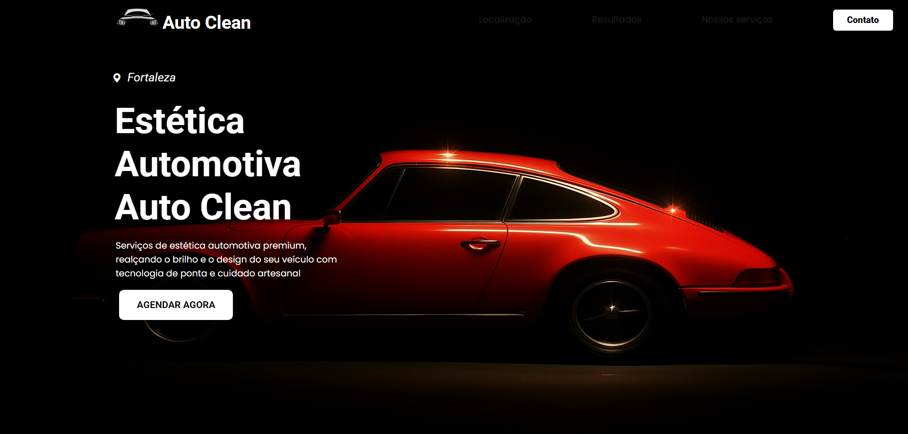

<h1 align="center">ProjetoAuto</h1>

<p align="center">
Programa exclusivo e gratuito.
</p>

<p align="center">
  <a href="#-tecnologias">Tecnologias</a>&nbsp;&nbsp;&nbsp;|&nbsp;&nbsp;&nbsp;
  <a href="#-projeto">Projeto</a>&nbsp;&nbsp;&nbsp;|&nbsp;&nbsp;&nbsp;
  <a href="#-layout">Layout</a>&nbsp;&nbsp;&nbsp;|&nbsp;&nbsp;&nbsp;
  <a href="#memo-licença">Licença</a>
</p>

<p align="center">
  
</p>

<br>

<p align="center">
  
</p>

# Template de Landing Page de Estética Automotiva

Bem-vindo ao **Template de Landing Page de Estética Automotiva**,
desenvolvida para destacar os serviços de cuidados automotivos com sofisticação, desempenho e presença digital. Este modelo é ideal para empresas e profissionais que oferecem polimento, vitrificação, higienização interna, lavagem técnica e outros serviços de alto padrão para veículos.

Projetada com um visual moderno, responsivo e atrativo, esta página ajuda a comunicar confiança, profissionalismo e paixão pelo cuidado automotivo. Seja para atrair novos clientes, agendar serviços ou apresentar seu portfólio, nossa estrutura oferece a base perfeita para impactar seu público.

Ideal para:

Estúdios de detalhamento automotivo

Profissionais de estética automotiva

Franquias e empresas especializadas

Serviços premium de lavagem e conservação de veículos

📲 Transforme visitantes em clientes com uma apresentação envolvente, focada nos resultados e diferenciais do seu trabalho.

## 🖥️ Demonstração

Você pode visualizar o site de exemplo no seguinte link:

👉 [Visualizar Site Exemplo](https://projeto-auto.netlify.app/)

## 🚀 Funcionalidades

- Design moderno e responsivo, adaptado para dispositivos móveis.
- Seções para "Sobre", "Serviços", "Contato", entre outras.
- Animações suaves ao rolar a página, utilizando a biblioteca AOS.
- Código otimizado para SEO e desempenho.
- Fácil personalização para incluir suas informações e branding.

## 📋 Como Utilizar

1. **Clone o Repositório**

   ```bash
   git clone https://github.com/FranciscoMarquesdev/ProjetoAuto.git
   ```

2. **Abra no seu editor de código favorito (VS Code, Sublime, etc.).**

3. **Edite o conteúdo**

   - Substitua as imagens, textos e informações pessoais nas respectivas seções do código.

4. **Hospede seu landing page**
   - O site é estático, então pode ser hospedado facilmente em plataformas como Netlify, Vercel ou GitHub Pages.

## 🔧 Tecnologias Utilizadas


## 📦 Instalação

Não é necessário instalar nada além de um editor de texto e um navegador para testar. Você pode modificar o conteúdo diretamente nos arquivos HTML e CSS.

## 👨‍🏫 Sobre Mim

Eu sou **Francisco Marques**, estudante de Análise e Desenvolvimento de Sistemas, atualmente no segundo semestre, e estou apaixonado por tecnologia e desenvolvimento web. Desde que comecei minha jornada, adquiri experiência sólida em HTML, CSS e JavaScript, ferramentas fundamentais para a criação de sites interativos e responsivos.

## 🎁 Como Contribuir

Se você tem sugestões de melhorias ou encontrou algum bug, fique à vontade para contribuir com o projeto. Basta abrir uma issue ou fazer um pull request.
